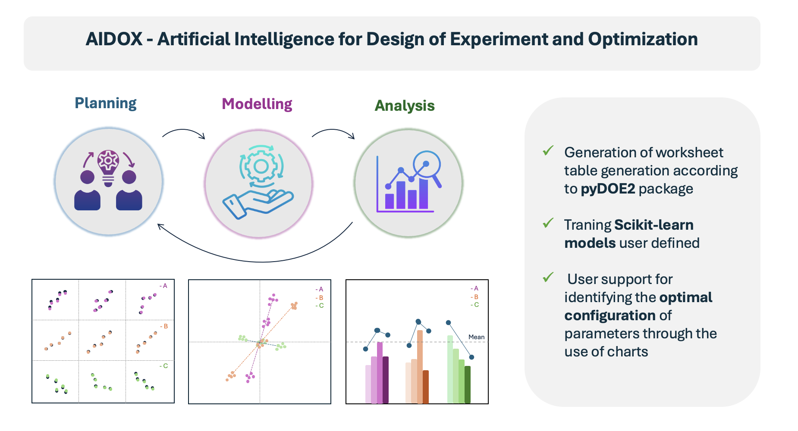
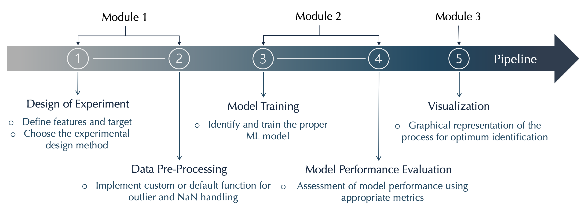
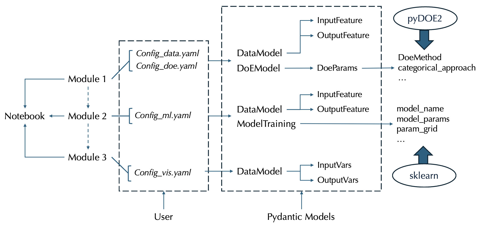

# AIDOX - Artificial Intelligence for Design of Experiment and Optimization 



The aim of this framework is assist users in selecting and adjusting operating parameters to reach a predefined optimal configuration in the context of constrained optimization problems. In fact, given the indipendent variables of the process with their associated degrees of freedom and definend the targets, this tool enables users to obtain:

 * Functional working table according to Desing of Experiment theory (pyDOE2 package)
 * Mapping the proccess thanks to ML algorithms (sklearn models)
 * Elaborate 'biplot-like' graphs that aids in the search for the optimum 

The primary advantage of this framework, based on data-driven approach, is its ability to produce a well-structured database that not only facilitates the prediction of the system's response but also streamlines the configuration of process parameters which are subject to constraints.

*Note for users: In this repo, it's also present a notebook folder ([relative link](docs/tutorial/notebook)) containing examples for each modules. They are useful in order to obtain all the results directly, starting from the compilation of the configuration yaml file (as described below).*


# Table of Contents

- [Technical background](#technical-background)
- [User Guide](#user-guide)
  -  [How to install](#how-to-install)
  - [Example of usage](#example-of-usage)
      - [Module 1: Design of Experiment](#module-1-design-of-experiment)
      - [Module 2: Model fitting and performance evaluation](#module-2-model-fitting-and-performance-evaluation)
      - [Module 3: Data Visualization](#module-3-data-visualization)
   

## Technical background

Mathematically, the concept of optimizatioin can be expressed as finding the best possible solution by changing variables that can be controlled and often subject to constrains [1]. Depending on the type of system variables, it is possible to distinguish between discrete and continuous optimization problems. Indeed, while in the first case the aim is to find the best combination of discrete variables from a combinatorial set, in the second case we want to find the optimum value of a continuous function. Most engineering problems fall into the latest (e.g. deisgning a turbine blade to minimize aerodynamic drag, finding the best nuclear core structure to minimize the fuel consumption, defining the optimal trajectory for an autonomous driving vehicle).

Commonly, a continuous optimization problem is formulated as:


>$$
\begin{align*}
\text{minimize} \quad & f(x), \\
                      & \text {with} \quad x'_k\leq x_k,\leq x''_k, \quad k = 1, \dots, q  \\
\text{subject to} \quad & g_i(x) \leq 0, \quad i = 1, \dots, m \\
                        & h_j(x) = 0, \quad j = 1, \dots, p
\end{align*}
$$

Here, <em>f(x)</em> is the  <strong>objective function</strong>, <em> x</em> are the <strong> factors </strong>, <em> g(x) and h(x)</em> are the <strong> contraints </strong>.

The mathematical formulation of the objective function can be complex both in the presence of systems characterized by many features (<em>k</em> >>0) and in the presence of physical problems for which no validated physical model is available. In this context, machine learning tools can make a strong contribution. Indeed, using algorithms trained from experimental data, it is possible to extrapolate a fictitious function that best approximates the real objective function [2].
Moreover, for an artificial intelligence system, a large amount of data implies a greater information content from which the algorithm can learn, thus representing an advantage. However, it is essential to select the qualitatively most relevant data in order to avoid processing redundant, approximate or error- containing information. For these reasons, it is indispensable to proceed systematically in both the acquisition of data and its subsequent processing.

### References
[1] Martins J R R A and Ning S A 2021 Engineering design optimization (Cambridge; New York, NY: Cambridge University Press)\
[2] Garnett R Bayesian Optimization Book Bayesian Optimization Book


## User Guide



For theese reasons, the proposed solution is a <strong> pipeline </strong> that integrate several steps into a single flow in order to manage date in a more efficient and structured manner. The aim of the workflow is to elaborate a graphical representation of the process in order to assist the user in adjusting operative parameters to reach a predifined optimum reducing both experimental time and material consumption.

The frameworks is composed by three different and independent modules, respectively related to: 
* Design of Experiment
* Model fitting and performance evaluation
* Data visualization


## How to install

Create your python environment using Python 3.8, 3.9 or 3.10

  ```shell
    pip install -e aidox
  ```

## Example of usage

The repository contains a tutorial for each module stored in /docs/tutorial and can be launched from the root folder using the command

  ```shell
   # <name> e.g. run_doe_handler.py, run_model_handler.py, run_visualizer_handler.py

    python docs/tutorial/<name>

  ```
In order to understand the backend structure, a schema is  here provided




## Module 1 Design of Experiment

Thanks to this module it is possible to obtain the warktable for the execution of the experimental campaigns according to the input and output parameters and the DoE strategy defined in the the configuration file

* ### First step
The user have to define the value type and the structure of input and output to which apply Design of Experiment (DoE) tecnicque in the corrisponding configuration yaml file (/configs/opt_datamodel_pydantic.yml) that is processed by pydantic model 

  ```python
    from aidox.models.pydantic_models_data import DataModel, DOEModel, InputFeature,ValueRanges, FeatureTypeEnum, DoeParams, DoeMethod, DoeMethodEnum,  CategoricalApproachEnum,OutputFeature
  ```
#### Parameters:

* `input_vars: InputFeature`
  * `feature_name:str` factor name 
  * `id: str` factor identification number 
  * `default_value: Union[float, int, str]` value assigned by default in case of optimize=False.
  * `optimize: bool` True or False in order to select the optimized variables and the one for which default value is used
  * `value_range: ValueRanges`. It's low (lb) and up (ub) boundaries inside which the solution can be found. \
  eg:
  ```
  value_range = ValueRanges(lb:Union[int,float]=3, ub:Union[int,float]=7)
  ``` 
  * `value_list: list[str]` in case of catergorical variable, it's a list of all the
  possible variable that should be selected (eg.['red','green','blue'])
  * `value_type: FeatureTypeEnum` the variable type which might be Float (continuos variable), Cat (discrete variable, categorical) or OrdCat (discrete variable, ordered categorical) \
  eg:
  ```
  value_type = FeatureTypeEnum(str ='Float')
  ``` 
  * transform: transformation to be applied to the variable
  * transform_kwargs:

* `output_vars: OutputFeature`
  * `feature_name:str` factor name 
  * `id: str` factor identification number 

### Application example:
```python
    input0 = InputFeature(feature_name='A', id='id_01', default_value=100, optimize=True,
                          value_range=ValueRanges(lb=50, ub=100), value_list=[25, 75, 90],
                          value_type=FeatureTypeEnum('OrdCat'), transform=None, transform_kwargs=None)
    input1 = InputFeature(feature_name='B', id='id_02', default_value=60, optimize=True,
                          value_range=ValueRanges(lb=60, ub=1008.10), value_list=[45, 60, 197.90],
                          value_type=FeatureTypeEnum('Float'), transform=None, transform_kwargs=None)
    input2 = InputFeature(feature_name='C', id='id_03', default_value=240, optimize=True,
                          value_range=ValueRanges(lb=240, ub=8000), value_list=[240, 3880],
                          value_type=FeatureTypeEnum('OrdCat'), transform=None, transform_kwargs=None)
    input3 = InputFeature(feature_name='D', id='id_04', default_value=30, optimize=True,
                          value_range=ValueRanges(lb=30, ub=110), value_list=[30, 50,70],
                          value_type=FeatureTypeEnum('Float'), transform=None, transform_kwargs=None)
    input4 = InputFeature(feature_name='E', id='id_05', default_value='dog', optimize=True,
                          value_list=['sample_a', 'sample_b', 'sample_c'], value_type=FeatureTypeEnum('Cat'),
                          transform=None, transform_kwargs=None)
    output0 = OutputFeature(feature_name='output1', id='id_06')
    output1 = OutputFeature(feature_name='output2', id='id_07')

 ```
  ```python
    datamodel = DataModel(input_vars=[input0, input1, input2, input3, input4], output_vars=[output0, output1])
  ```

* ### Second step
The user have to set DoE strategy and constraints intends to adopt in the corrisponding configuration yaml file (/configs/opt_doe_pydantic.yml) that is processed by pydantic model 

#### Parameters:

 * `method: DoeMethodEnum`
    * `name: str` It requires the treatment structure chosen by the user. You can choose a strategy from the following: 'fullfact', 'ff2n', 'fracfact', 'gsd', 'lhs', 'pbdesign', 'bbdesign', 'ccdesign'. 
    * `kwargs: dict` in which to specify method-specific kwargs. 

    eg:
    ```
    method = DoeMethod(name='gsd', kwargs={'reduction':'2'})
    ```

* `categorical_approach: CategoricalApproachEnum`  Depending on how the categorical variables are to be treated, one of the following must be specified: 'undersampling', 'random', 'oversampling'. \
  eg:
    ```
    categorical_approach = CategoricalApproachEnum(str='random')
    ```

* mixture_design:
* `mixture_constraints: list[dict]`  in which you can specify the constraints to be placed on the design of experiment. For example :[{ 'formula': 'out = 0.7' , 'tol': .8 }]

### Application example:
```python
    doe_param = DoeParams(method = DoeMethod(name=DoeMethodEnum('fullfact'), kwargs = {}), categorical_approach = CategoricalApproachEnum('random'), mixture_design = None, mixture_constraints = [{'formula': 'out = 0.5','tol': .1}])
```

```python
    doemodel = DOEModel(doe_params=doe_param)
```
* ### Third step

In order to launch first module, it is necessary to initialise the DoELeapHandler object contained in aidox.optimization.handler_data
    
  ```python
     from aidox.optimization.handler_data import DoELeapHandler
  ```
This provides the two arguments (DOEModel and DataModel) previously initialised

  ```python
      doelab = DoELeapHandler(model=doemodel, datamodel=datamodel)
  ```
It is now possible to set the desired number of points (n_points = int) for the realisation of the work table (-> pandas DataFrame object)

  ```python
      points = doelab.ask(n_points = 3)
  ```

## Module 2 Model fitting and performance evaluation

This module it's responsible for preprocessing data and their fitting according to the specified ML algorithm setted in the configuration file.

* ### First step
The user have to define input and output of the process in the corrisponding configuration yaml file (/configs/opt_models_pydantic.yml) that is processed by pydantic model 

  ```python
    from aidox.models.pydantic_models_training import FeatureTypeEnum, InputFeature, OutputFeature, DataModel, ModelTraining
  ```

#### Parameters:
* `dataframe: dict` the key must be 'classifier' or 'regressor' according to the task and the value must be the dataframe path

* `input_vars: InputFeature`
    * `feature_name:str` factor name 
    * `id: str` factor identification number 
    * `feature_type: FeatureTypeEnum` the variable type which might be Float (continuos variable), Cat (discrete variable, categorical) or OrdCat (discrete variable, ordered categorical) 
    * `feature_description: str` description of the feature

* `output_vars: OutputFeature`
  * `feature_name:str` factor name 
  * `id: str` factor identification number 
  * `feature_type: FeatureTypeEnum` the variable type which might be Float (continuos variable), Cat (discrete variable, categorical) or OrdCat (discrete variable, ordered categorical) 
  * `feature_description: str` description of the feature

* `model_name: dict[str,str]` the key must be 'classifier' or 'regressor' according to the task and the value must be the name of ML model available on sklearn modules ('sklearn.ensemble', 'sklearn.gaussian_process', 'sklearn.linear_model', 'sklearn.neural_network')
* `model_params: dict[str,dict]` the key must be 'classifier' or 'regressor' and the value must be a dictionary with specific parameters
* `model_params: dict[str,dict]` the key must be 'classifier' or 'regressor' and the value must be a dictionary with specific GridSearchCV parameters


### Application example:
```python
    input0= InputFeature(feature_name='A',id= 'id_0', feature_type = FeatureTypeEnum('OrdCat'), feature_description =None)  
    input1= InputFeature(feature_name='B', id='id_1', feature_type = FeatureTypeEnum('OrdCat'), feature_description = None) 
    input2= InputFeature(feature_name='C',id='id_2', feature_type = FeatureTypeEnum('OrdCat'), feature_description = None) 
    input3= InputFeature(feature_name='D',id='id_3', feature_type = FeatureTypeEnum('OrdCat'),feature_description = None)
    
    output0= OutputFeature(feature_name='out1', id='out_0', feature_type = FeatureTypeEnum('Float'), feature_description = 'out1_description')
    output1= OutputFeature(feature_name='out2', id='out_1',feature_type = FeatureTypeEnum('Float'), feature_description ='out2_description')
    df = {'classifier': '../docs/data_processed/df_classifier.xlsx'}

    name = {'classifier':'RandomForestClassifier'}
    params = {'classifier':{}}
    param_grid = {'classifier':{"n_estimators"  : [50,80,100],"criterion":['entropy'], "max_depth":[8,16,32]}}

```
```python
  datamodel = DataModel(dataframe = df, input_vars = [input0,input1,input2,input3], output_vars=[output0,output1])
  model = ModelTraining(model_name = name, model_params = params, param_grid = param_grid)
```
* ### Second step
In order to launch second module, it is necessary to initialise the Classifier or Regressor object contained in aidox.optimization.handler_model
    
  ```python
     from aidox.optimization.handler_moel import Classifier, Regressor
  ```
This provides the two arguments (DataModel and ModelTraining) previously initialised

  ```python
    reg = Regressor(datamodel=datamodel, model_training = model)
    reg.train_test_split(method= 'standard')
    reg.model_prediction()
  ```

## Module 3 Data visualization
The aim of this last module is to provide data visualization in different forms like scatt, shap and biplot like graphs.  

* ### First step
The user have to define input and output of the process in the corrisponding configuration yaml file (/configs/opt_visualization_pydantic.yml) that is processed by pydantic model 

  ```python
    from aidox.models.pydantic_models_visualization import FeatureTypeEnum, InputFeature, OutputFeature, DataModel
  ```

#### Parameters:
* `dataframe: str` dataframe path

* `input_vars: InputFeature`
    * `feature_name:str` factor name 
    * `id: str` factor identification number 
    * `value_list: list`  listo of levels 
    * `value_type: FeatureTypeEnum` the variable type which might be Float (continuos variable), Cat (discrete variable, categorical) or OrdCat (discrete variable, ordered categorical) 
    * `feature_description: str` description of the feature

* `output_vars: OutputFeature`
  * `feature_name:str` factor name 
  * `id: str` factor identification number 
  * `value_type: FeatureTypeEnum` the variable type which might be Float (continuos variable), Cat (discrete variable, categorical) or OrdCat (discrete variable, ordered categorical) 
  * `feature_description: str` description of the feature


### Application example:
```python
    file = '../docs/data_processed/predicted_df.xlsx'

    input0= InputFeature(feature_name='A',id= 'id_0',  value_list = [50,75,100] ,value_type = FeatureTypeEnum('OrdCat'), feature_description =None)  
    input1= InputFeature(feature_name='B',id='id_2', value_list = [240,3880,8000], value_type = FeatureTypeEnum('OrdCat'), feature_description = None) 
    input2= InputFeature(feature_name='C',id='id_3', value_list = [30,50, 70, 90, 110] ,value_type = FeatureTypeEnum('OrdCat'),feature_description = None)
    output2= OutputFeature(feature_name='out1', id='out_0', value_type = FeatureTypeEnum('Float'), feature_description = 'out1_description')
    output3= OutputFeature(feature_name='out2', id='out_1',value_type = FeatureTypeEnum('Float'), feature_description ='out2_description')
```
```python
  datamodel = DataModel (dataframe = file, input_vars = [input0,input1,input2] , output_vars=[output2,output3])
```

* ### Second step
In order to launch the last module, it is necessary to initialise the Visualization object contained in aidox.optimization.handler_visualization    
    
  ```python
     from aidox.optimization.handler_visualization import  Visualization
  ```
This provides the two arguments (DataModel) previously initialised

  ```python
    graph = Visualization(data = datamodel)
    # Scatter plot data 
    graph.scatter_pltot(x = 'C', y = ['out1', 'dout1_pred'], col = 'A', row = 'B', orders = {'A': [50, 75, 100],'B': [240,3880  8000]}, title = 'Design Optimization')

    # Shap analysis and centroids
    graph.SHAP_analysis(target ='output1', estimator = RandomForestRegresso  (n_estimators=100, random_state=42))
    shap_values_target_1 = graph.shap_values
    graph.biplot_centroids()
    feature_target1 = graph.features_target1    
    graph.SHAP_analysis(target ='output2', estimator = RandomForestRegresso  (n_estimators=100, random_state=42))
    shap_values_target_2 = graph.shap_values
    graph.biplot_centroids()
    feature_target2 = graph.features_target1

    # Biplot graphs
    graph.biplot_features(shap_values_target_1 = shap_values_target_1,  shap_values_target_2 = shap_values_target_2, features_target1 =   feature_target1, features_target2 = feature_target2, title= 'Biplot like analysis', colors_x =['b','m','green'], colors_points = ['c','violet','y'])
  ```

