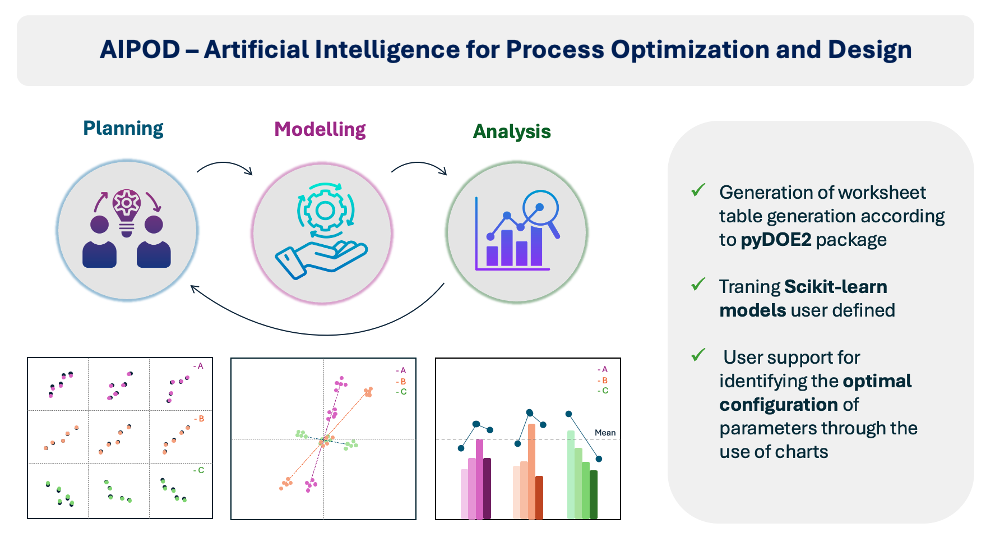
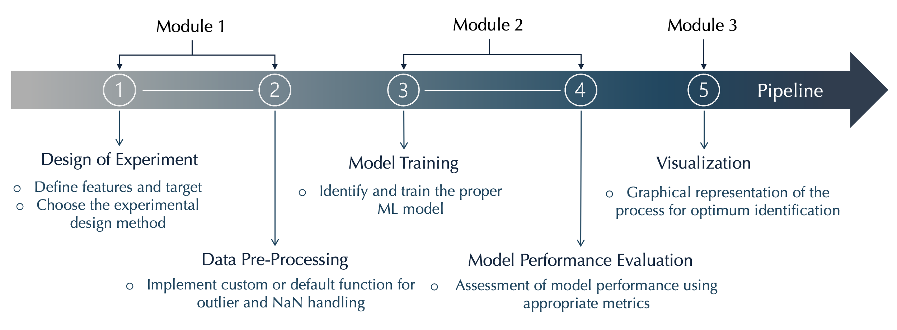
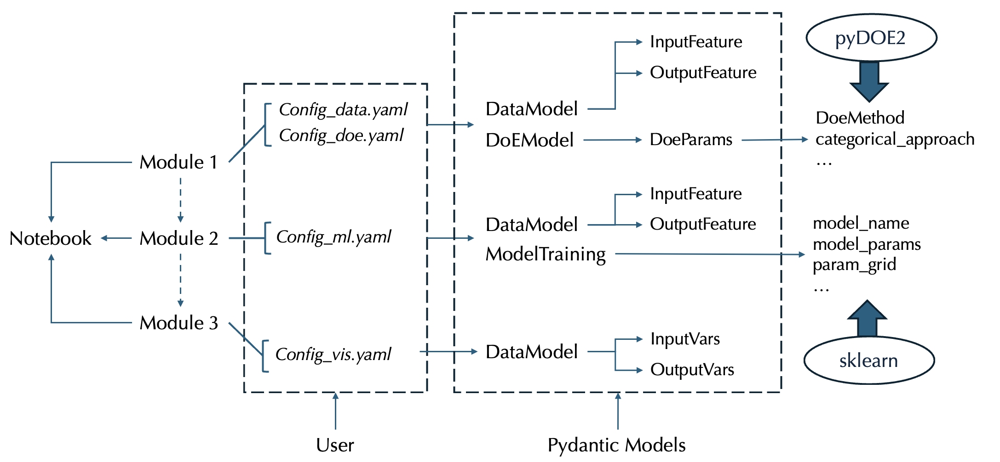

# AIPOD – Artificial Intelligence for Process Design and Optimization



**AIPOD** is a modular, data-driven framework designed to support **process design and constrained optimization** in engineering and experimental contexts where analytical models are unavailable, incomplete, or too expensive to evaluate.

The framework integrates **Design of Experiments (DoE)**, **machine-learning-based surrogate modeling**, and **advanced data visualization** into a single, structured workflow aimed at guiding decision-making toward optimal operating conditions.

---
# Table of Contents

- [Motivation and scope](#motivation-and-scope)
- [Conceptual workflow](#conceptual-workflow)
- [Repository structure](#repository-structure)
- [Installation](#installation)
- [Modules overiview](#modules-overiview)
- [Backend structure](#backend-structure)
- [Technical background](#technical-background)
- [References](#references)
  

## Motivation and scope

Many engineering optimization problems involve:
- multiple interacting variables,
- physical or operational constraints,
- limited or expensive experimental campaigns.

In such scenarios, classical optimization approaches are often impractical.  
AIPOD addresses this gap by enabling a **data-driven approximation of the objective function**, coupled with a structured exploration of the design space.

Typical application domains include:
- experimental engineering and R&D,
- process optimization under constraints,
- data-driven system exploration,
- surrogate modeling for expensive simulations or experiments.

---

## Conceptual workflow



AIPOD is organized as a **pipeline** composed of three independent but interoperable modules:

1. **Design of Experiment (DoE)**  
2. **Model fitting and performance evaluation**  
3. **Data visualization and interpretability**

Each module is configured through **validated YAML configuration files** and implemented using **Pydantic models** to enforce consistency and correctness.

---

## Repository structure

```text
configs/        # YAML configuration files (validated with Pydantic)
data/           # Raw, interim and processed data (not versioned)
docs/           # Tutorials and extended documentation
images/         # README assets
notebooks/      # Exploratory and example notebooks
src/aipod/      # Core framework source code
tests/          # Unit tests

```
---

## Installation

Create and activate a Python environment (Python 3.8–3.10 recommended), then install the package in editable mode from the project root:

```shell
pip install -e .
```
---
## Modules overview


### 1. Design of Experiment
- **Purpose:** Structured exploration of the design space  
- **Methods:** Full factorial, GSD, LHS, Box–Behnken, Central Composite etc  
- **Supports:** Continuous and categorical variables, constraints, mixtures  
- **Config:** `configs/opt_datamodel_pydantic.yml`, `configs/opt_doe_pydantic.yml`

### 2. Model fitting and performance evaluation
- **Purpose:** Surrogate model training and evaluation  
- **Methods:** Scikit-learn estimators + grid search  
- **Tasks:** Preprocessing, training, validation  
- **Config:** `configs/opt_models_pydantic.yml`

### 3. Data visualization and interpretability
- **Purpose:** Insight into learned surrogate models  
- **Tools:** Scatter plots, SHAP analysis, biplot-like visualizations  
- **Focus:** Interpretability over pure prediction accuracy

---
## Backend structure


The backend is designed to clearly separate:
* data definition and validation
* model training and evaluation
* visualization and interpretation logic

This separation allows the framework to remain extensible and maintainable.

---
## Technical background

From a mathematical perspective, AIPOD addresses continuous constrained optimization problems of the form:
>$$
\begin{align*}
\text{minimize} \quad & f(x), \\
                      & \text {with} \quad x'_k\leq x_k,\leq x''_k, \quad k = 1, \dots, q  \\
\text{subject to} \quad & g_i(x) \leq 0, \quad i = 1, \dots, m \\
                        & h_j(x) = 0, \quad j = 1, \dots, p
\end{align*}
$$

Here, <em>f(x)</em> is the  <strong>objective function</strong>, <em> x</em> are the <strong> factors </strong>, <em> g(x) and h(x)</em> are the <strong> contraints </strong>.

The objective function is approximated through machine-learning-based surrogate models trained on experimental or simulated data.
A structured acquisition of data via Design of Experiments is used to maximize information content while minimizing experimental cost.

---

## Detailed technical documentation
Detailed, step-by-step examples for each module — including configuration files, code usage, and outputs — are available in :

```shell
docs/tutorial
```
These documents contain the full technical reference and implementation details.

---

## References

1. Martins, J. R. R. A., & Ning, S. A. (2021). Engineering Design Optimization. Cambridge University Press.
2. Garnett, R. Bayesian Optimization. Bayesian Optimization Book
3. Grande M., Gallingani T., et al. (2025). An explainable data-driven framework for material processing: integrating design of experiment and machine learning in laser ablation. 10.21203/rs.3.rs-7857002/v1. 